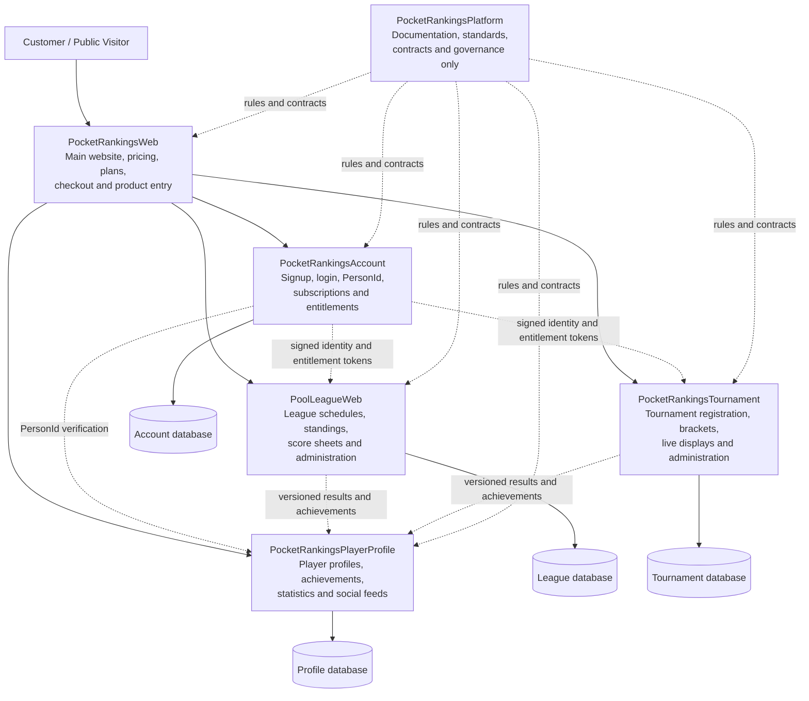

# Pocket Rankings Product Repository Architecture

Last reviewed: 2026-09-15

## Purpose

Pocket Rankings is a family of separately deployed products. The Platform repository defines their shared rules, contracts, terminology, security expectations, and design conventions. It does not host customer-facing webpages or shared runtime state.

Each webpage belongs to the repository that owns the behavior and data shown on that page. The marketing Website acts as the public front door and links customers into the separately operated products.

## Repository interaction diagram

## Where webpages live

| Page or workflow | Owning repository |
|---|---|
| Company homepage, product descriptions, pricing, plan selection, and checkout | `PocketRankingsWeb` |
| Signup, login, account settings, identity, and subscription access | `PocketRankingsAccount` |
| League schedules, standings, score sheets, rosters, and league administration | `PoolLeagueWeb` |
| Tournament directory, registration, brackets, temporary live URLs, results, and tournament administration | `PocketRankingsTournament` |
| Player directory, individual profiles, achievements, statistics, and public social links | `PocketRankingsPlayerProfile` |
| No customer-facing webpages; shared governance and architecture only | `PocketRankingsPlatform` |

## Interaction rules

- Every product owns its webpages, application code, database, network, queues, configuration, credentials, backups, and operational state.
- No product queries another product's database or shares its database credentials.
- Account owns the durable `PersonId` and issues the approved signed identity and entitlement information consumed by products.
- League and Tournament send versioned, authenticated events to Player Profile after the cross-product transport is approved. Player Profile does not scrape or directly query either source database.
- The Platform repository may document a shared visual language and proven contracts. Shared runtime code requires a separately approved, versioned internal-library phase.
- A shared reverse proxy may route different hostnames to the correct product, but routing does not combine their containers or databases.
- League and Tournament are purchased and provisioned separately. Each
  customer product receives its own isolated runtime stack and database from
  the same validated product image; it does not receive a new repository or
  customer-specific build.
- Account, Player Profile, and the marketing Website remain shared services.

See [`AUTOMATED_PROVISIONING.md`](AUTOMATED_PROVISIONING.md) for purchase
provisioning and [`DATA_LIFECYCLE.md`](DATA_LIFECYCLE.md) for the 61-day
customer-product retention and global player-data opt-out workflows.

## Public website status

`PocketRankingsWeb` is the intended front door for product information, pricing, checkout, and access links. Its current README describes it as scaffolding only, so the public front-door runtime still needs its own approved implementation phase. Product-specific working pages remain in their respective product repositories rather than moving into the Website or Platform repository.
